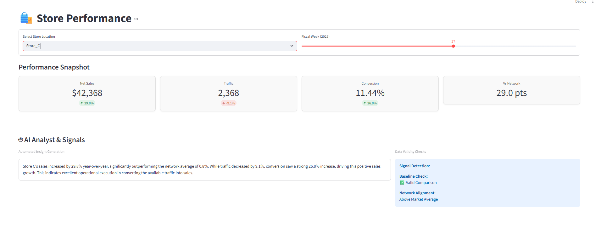

# Store Performance Insight - AI Prototype

## Project Overview
This repository contains a **Minimal Working Prototype (MWP)** for an AI-based feature designed to help retail store managers interpret their weekly performance.

Instead of forcing managers to analyze raw rows of data, this tool processes the "Standard Retail Equation" (Traffic × Conversion × UPT × AUP), compares it against network trends, and uses an LLM to generate a natural language executive summary.

### Value Proposition & Reason to Believe
*   **The Problem:** Managers receive data, but not *insights*. They struggle to determine if a sales drop is due to poor execution (Conversion) or lack of demand (Traffic), and whether their performance is an isolated incident or a market trend.
*   **The Solution:** A context-aware dashboard that pre-processes Year-over-Year (YoY) comparisons and network benchmarks before generating an AI summary.
*   **Reason to Believe:** By feeding the LLM derived features (deltas, gaps, and anomaly flags) rather than raw numbers, we reduce hallucinations and ensure the insight is mathematically grounded in the retail equation.

---

## Screenshots

| High Performance Store | Underperforming Store |
|:---:|:---:|
|  |  |
| *Store C outperforming the network with strong conversion.* | *Store B identifying traffic as the root cause.* |

---

## Technical Implementation

### Tech Stack
*   **Language:** Python 3.9+
*   **Frontend:** Streamlit (for rapid prototyping)
*   **Data Processing:** Pandas
*   **AI Model:** Google Gemini 2.5 Flash Lite (via `google-genai` SDK)

### The Data Pipeline (Privacy & Logic)
To meet the **AI Researcher** and **Privacy** constraints, the application uses a structured pre-processing pipeline:

1.  **Feature Engineering:** Raw data is converted into the Retail Equation metrics (Conversion Rate, UPT, AUP).
2.  **Network Aggregation:** The store is compared against the "Rest of Market" to calculate a `gap_to_network` score.
3.  **Anomaly Detection:** Before calling the LLM, the system checks for `baseline_abnormal` (e.g., if the store was closed or under construction the previous year).
4.  **Privacy Barrier:** **No raw transaction logs or PII are sent to the LLM.** Only aggregated percentages, deltas, and boolean flags are transmitted.

### LLM Strategy
We use a **Deterministic Prompting** strategy. The System Prompt acts as a decision tree:
1.  **Check Baseline:** If `baseline_abnormal == True`, explicitly warn the user that YoY data is unreliable.
2.  **Root Cause Analysis:** Determine if the driver is Traffic (Marketing issue) or Conversion (Operational issue).
3.  **Contextualize:** Compare store performance vs. network performance.

---

## Setup & Installation

### Prerequisites
*   Python installed.
*   A Google Gemini API Key (or OpenAI key if you modify the client).

### 1. Clone & Install Dependencies
```bash
# Clone repository
git clone https://github.com/OussamaLafdil/Yoobic_ML_Test.git

# Install requirements
pip install streamlit pandas openpyxl python-dotenv google-genai
```

### 2. Environment Configuration
Create a `.env` file in the root directory and add your API key:
```ini
GEMINI_API_KEY=your_api_key_here
```

### 3. Data Setup
Ensure `data.xlsx` is present in the root directory with the following columns:
`Store Name`, `Year`, `Week`, `traffic`, `gross_transactions`, `gross_quantity`, `net_sales`.

### 4. Run the Application
```bash
streamlit run app.py
```

---

## Scope & Future Roadmap

### Implemented in v1 (The Prototype)
*   **End-to-end flow:** Data ingestion to UI display.
*   **Retail Math:** Full calculation of the standard retail equation.
*   **Privacy-safe context:** Sending only derived features to the LLM.
*   **Baseline validation:** Flagging abnormal previous years (e.g., low traffic).
*   **Network comparison:** Contextualizing performance against the market.

### Scope for v2 (Next Iteration)
1.  **Enhanced Anomaly Detection:** Replace hardcoded thresholds (e.g., `traffic < 200`) with dynamic Z-score statistical anomaly detection to identify "unusual values" more accurately.
2.  **User Feedback Loop:** Add 👍/👎 buttons to the AI insight to build a fine-tuning dataset (RLHF) for store-specific tone.
3.  **Actionable Recommendations:** Connect root causes to specific playbooks (e.g., "Conversion is down → Suggest reviewing scheduling efficiency").
4.  **Drill-down UI:** Allow clicking a KPI to see the daily breakdown trend.
